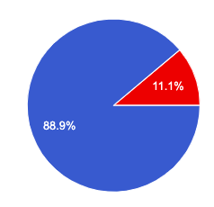

# SE-G23-HW3-GameofLife-Experiment-and-Results

## Methods
1. **Defining the problem:** We implemented Game of Life in three different languages: Scala, Kotlin and Julia. We added 2 bugs in each code.
   - Logical bug: To evaluate how easily debugger can understand syntactical differences present in the language compared to other languages. Also to see how useful are online resources in understanding the language.
   - Compilation bug: To check if compiler messages are useful enough to solve such errors. If not, how useful are online resources.
2. **Sign-up process:** We got 10 entries in our sign-up sheet. We scheduled a a zoom meeting at a time of participants' convenience. Prior to meeting, we sent them required resources' link and a token (key) via email. We ran the each meetings for 30 minutes.
3. **Debugging session:**
   - Participants were asked to share the screen throughout the debugging session.
   - 2 of our team members attended each session as hosts.
   - Participants were given some instruction by hosts about the proceedings of the session. (e.g. Reading the readme file, filling each section of the survey form when they finish debugging of that particular language, etc.)
   - Hosts tried to give as less hints as they could so we could avoid having the hosts' bias on our results.
   - We asked participants to fill [this google form](https://forms.gle/ZBSEVTSdRgGMewXd9) to have their input on what they felt about each language. The data collected from this form is described [here in 'Google Form inputs' section](https://github.com/cagandhi/SE-G23-GameofLife#data-collection-tools).
   - The session hosts observed the pariticipant's screen and wrote down some manual observations in [this google sheet](https://docs.google.com/spreadsheets/d/1mUfDjupsczMQOG7zdjMPwpimFpN12EN1l0mqjGJAVts/edit?usp=sharing). The data collected in this sheet is described [here in 'Manual observations' section](https://github.com/cagandhi/SE-G23-GameofLife#data-collection-tools).

## Materials
1. [Scala code and instructions](code/Scala) to run the code
2. [Kotlin code and instructions](code/Kotlin) to run the code
3. [Julia code and instructions](code/Julia) to run the code
4. [Sign-up sheet](https://docs.google.com/spreadsheets/d/1dIk09K08NHOU7tahJJxVNWINKzf7a-8cJRiyL2sZv7U/edit?usp=sharing) for debugging sessions.
5. [Instructions for debuggers](https://github.com/cagandhi/SE-G23-GameofLife/blob/master/README.md) to read before attending the debugging session.
6. [Survey form](https://forms.gle/ZBSEVTSdRgGMewXd9) filled by debugger. Different sections of the form were filled by debuggers as and when they completed a language.
7. [Responses to the above form](https://docs.google.com/spreadsheets/d/1SGUMTA03mUHiHK_vWSbzI5hWNUmOXegXUg9bOGBiT1Q/edit?usp=sharing).
8. [Manual observations](https://docs.google.com/spreadsheets/d/1mUfDjupsczMQOG7zdjMPwpimFpN12EN1l0mqjGJAVts/edit?usp=sharing) taken by session hosts.

## Observations

### Familiarity with languages

* This shows the languages subjects were familiar with prior to the experiment. We see that subjects didn't have prior exposure to Julia and Scala however 2/9 subjects were exposed to Kotlin previously. This should result in a more or less equal experiment setup as majority of subjects had no experience with any of the 3 languages.
* We also see that 7/9 people have experience in Python since Python has become extremely popular recently because of easy syntax and various frameworks for webapps being built around Python.

### Time since language last used

&nbsp;&nbsp;&nbsp;&nbsp;&nbsp;&nbsp;&nbsp;&nbsp;&nbsp;&nbsp;&nbsp;&nbsp;&nbsp;&nbsp;&nbsp;&nbsp;&nbsp;&nbsp;&nbsp;&nbsp;&nbsp;&nbsp;&nbsp;&nbsp;Scala&nbsp;&nbsp;&nbsp;&nbsp;&nbsp;&nbsp;&nbsp;&nbsp;&nbsp;&nbsp;&nbsp;&nbsp;&nbsp;&nbsp;&nbsp;&nbsp;&nbsp;&nbsp;&nbsp;&nbsp;&nbsp;&nbsp;&nbsp;&nbsp;&nbsp;&nbsp;&nbsp;&nbsp;&nbsp;&nbsp;&nbsp;&nbsp;&nbsp;&nbsp;&nbsp;&nbsp;&nbsp;&nbsp;&nbsp;&nbsp;&nbsp;&nbsp;&nbsp;&nbsp;&nbsp;&nbsp;&nbsp;&nbsp;&nbsp;&nbsp;&nbsp;&nbsp;Kotlin&nbsp;&nbsp;&nbsp;&nbsp;&nbsp;&nbsp;&nbsp;&nbsp;&nbsp;&nbsp;&nbsp;&nbsp;&nbsp;&nbsp;&nbsp;&nbsp;&nbsp;&nbsp;&nbsp;&nbsp;&nbsp;&nbsp;&nbsp;&nbsp;&nbsp;&nbsp;&nbsp;&nbsp;&nbsp;&nbsp;&nbsp;&nbsp;&nbsp;&nbsp;&nbsp;&nbsp;&nbsp;&nbsp;&nbsp;&nbsp;&nbsp;&nbsp;&nbsp;&nbsp;&nbsp;&nbsp;&nbsp;&nbsp;&nbsp;&nbsp;&nbsp;&nbsp;Julia

* The subjects have had less exposure with Scala since most of them used scala within the last week and we believe they would have used that in scope of this experiment. Similarly, subjects possesed little familiarity with Kotlin and Julia in the past.

### Time spent with language before the experiment

&nbsp;&nbsp;&nbsp;&nbsp;&nbsp;&nbsp;&nbsp;&nbsp;&nbsp;&nbsp;&nbsp;&nbsp;&nbsp;&nbsp;&nbsp;&nbsp;&nbsp;&nbsp;&nbsp;&nbsp;&nbsp;&nbsp;&nbsp;&nbsp;Scala&nbsp;&nbsp;&nbsp;&nbsp;&nbsp;&nbsp;&nbsp;&nbsp;&nbsp;&nbsp;&nbsp;&nbsp;&nbsp;&nbsp;&nbsp;&nbsp;&nbsp;&nbsp;&nbsp;&nbsp;&nbsp;&nbsp;&nbsp;&nbsp;&nbsp;&nbsp;&nbsp;&nbsp;&nbsp;&nbsp;&nbsp;&nbsp;&nbsp;&nbsp;&nbsp;&nbsp;&nbsp;&nbsp;&nbsp;&nbsp;&nbsp;&nbsp;&nbsp;&nbsp;&nbsp;&nbsp;&nbsp;&nbsp;&nbsp;&nbsp;&nbsp;&nbsp;Kotlin&nbsp;&nbsp;&nbsp;&nbsp;&nbsp;&nbsp;&nbsp;&nbsp;&nbsp;&nbsp;&nbsp;&nbsp;&nbsp;&nbsp;&nbsp;&nbsp;&nbsp;&nbsp;&nbsp;&nbsp;&nbsp;&nbsp;&nbsp;&nbsp;&nbsp;&nbsp;&nbsp;&nbsp;&nbsp;&nbsp;&nbsp;&nbsp;&nbsp;&nbsp;&nbsp;&nbsp;&nbsp;&nbsp;&nbsp;&nbsp;&nbsp;&nbsp;&nbsp;&nbsp;&nbsp;&nbsp;&nbsp;&nbsp;&nbsp;&nbsp;&nbsp;&nbsp;Julia

* We see that the majority of the subjects don't have exposure to any of the languages we used for our experiment and hence majority fall in the 0-5 hrs slab. Also, there are some subjects who have used Julia previously for more than a year.
* We believe subjects have not filled the data for languages familiar to them properly since some subjects have used Julia previously for over a year but they did not list Julia in the languages familiar to them.

### Mean Debug Times for languages

* This plot shows that the mean debug time to solve the compilation error in Scala is minimum. This means that people were able to solve the compilation bug quickly in Scala and this fact is strengthened by the fact that 7/9 people found Scala easy to debug because of extremely helpful compilation error messages. 
* However, the debug time for logical error is maximum for Scala and we attribute this increase in time to a trickier logical bug in Scala.
* It is also visible that the complete debug time for both bugs was lowest in Julia and we believe this is due to the subjects' exposure to Python which is extremely similar to Julia.

### Which language was easy to debug?

* Scala turned out to be the most difficult to debug given that the subjects were not familiar with the language, given the lack of experience by the subjects. Moreover, Julia being similar to python - subjects found it easiest to work with. 

### Which language did you find interesting?

* Subjects, being less exposed to Scala, found its code style unique, unfamiliar and displayed their curiosity to explore it more in the future. 
* We also see that Julia was the least interesting for the subjects and we believe there might be a couple of reasons for that. Firstly, Julia is very much like Python and used for similar purposes. Since we saw that the majority of the subjects were exposed to Python, they would not find value in learning a new language. Secondly, as subjects complained during the session, Julia's compilation error message was not at all helpful which might have also influenced their decision to not pursue it in the future.

## Conclusions
* The better error messages help developer to quickly resolve the compilation issue whereas the familiarity with the syntax and semantics of language help to resolve the logical error quickly.
* Participants found most difficult to debug language as most interesting.

## Threats to validity
* Some of the bugs were hard to find due to less understanding of the language.To increase the validity of the testing, the tester's prior knowledge to the language should have been considered.
* As the problem statement was known to the participants and if the language was also familiar to them then it made it too easy for them to find bugs.
* There was a possibility of redundant bugs to be found in same languages as the participants were part of multiple experiments. This made them easy to find the bug.
* The difficulty of bug should not only be in the logic but also the participant's ability to debug the syntax of the code.
* The runtime of code contributed to the participant's ability to debug code faster such as "julia" took less time and "Scala" took more time to run. This parameter should be considered for the experiment.
* Also the error messages from different languages contributed to the debug time such as the error message of "julia" was irrelevant for syntax error whereas for scala it gave proper explanation and helped to debug the syntax error.
