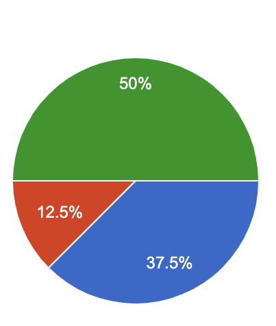
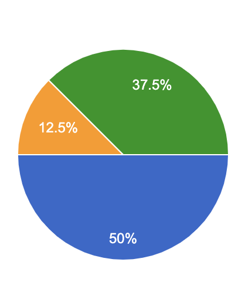

# SE-G23-HW3-GameofLife-Experiment-and-Results

## Methods
1. **Defining the problem:** We implemented Game of Life in three different languages: Scala, Kotlin and Julia. We added 2 bugs in each code.
   - Logical bug: To evaluate how easily debugger can understand syntactical differences present in the language compared to other languages. Also to see how useful are online resources in understanding the language.
   - Compilation bug: To check if compiler messages are useful enough to solve such errors. If not, how useful are online resources.
2. **Sign-up process:** We got 10 entries in our sign-up sheet. We scheduled a a zoom meeting at a time of participants' convenience. Prior to meeting, we sent them required resources' link and a token (key) via email. We ran the each meetings for 30 minutes.
3. **Debugging session:**
   - Participants were asked to share the screen throughout the debugging session.
   - 2 of our team members attended each session as hosts.
   - Participants were given some instruction by hosts about the proceedings of the session. (e.g. Reading the readme file, filling each section of the survey form when they finish debugging of that particular language, etc.)
   - Hosts tried to give as less hints as they could so we could avoid having the hosts' bias on our results.
   - We asked participants to fill [this google form](https://forms.gle/ZBSEVTSdRgGMewXd9) to have their input on what they felt about each language. The data collected from this form is described [here in 'Google Form inputs' section](https://github.com/cagandhi/SE-G23-GameofLife#data-collection-tools).
   - The session hosts observed the pariticipant's screen and wrote down some manual observations in [this google sheet](https://docs.google.com/spreadsheets/d/1mUfDjupsczMQOG7zdjMPwpimFpN12EN1l0mqjGJAVts/edit?usp=sharing). The data collected in this sheet is described [here in 'Manual observations' section](https://github.com/cagandhi/SE-G23-GameofLife#data-collection-tools).

## Materials
1. [Scala code and instructions](code/Scala) to run the code
2. [Kotlin code and instructions](code/Kotlin) to run the code
3. [Julia code and instructions](code/Julia) to run the code
4. [Sign-up sheet](https://docs.google.com/spreadsheets/d/1dIk09K08NHOU7tahJJxVNWINKzf7a-8cJRiyL2sZv7U/edit?usp=sharing) for debugging sessions.
5. [Instructions for debuggers](https://github.com/cagandhi/SE-G23-GameofLife/blob/master/README.md) to read before attending the debugging session.
6. [Survey form](https://forms.gle/ZBSEVTSdRgGMewXd9) filled by debugger. Different sections of the form were filled by debuggers as and when they completed a language.
7. [Responses to the above form](https://docs.google.com/spreadsheets/d/1SGUMTA03mUHiHK_vWSbzI5hWNUmOXegXUg9bOGBiT1Q/edit?usp=sharing).
8. [Manual observations](https://docs.google.com/spreadsheets/d/1mUfDjupsczMQOG7zdjMPwpimFpN12EN1l0mqjGJAVts/edit?usp=sharing) taken by session hosts.

## Observations

* As observed, the subjects have had less exposure with scala since most of them used scala within the scope of this experiment.
* Similarly, subjects were possesed little fimiliarity with Kotlin and Julia in past. 

* Subjects being very less exposed to Scala, they found it's code style unique and very unfimiliar. Hence it turned out to be most interesting language.

* Scala turned out to be most difficult, given the lack of experience by the subjects. Moreover, Julia being similar to python - subjects found it easiest to work with. 
## Conclusions

## Threats to validity
* Some of the bugs were hard to find due to less understanding of the language.
* As the problem statement was known to the participants and if the language was also familiar to them then it made it too easy for them to find bugs.
* Possibility of redundant bugs in same languages as the participants were part of multiple experiments.
* To increase the validity of the testing, the tester's prior knowledge to the language should have been considered.
* Also the difficulty of bug is not only in the logic but also the participant's ability to debug the syntax of the code.
* Also if the runtime of code contributed to the participant's ability to debug code faster such as "julia" took less time and "Scala" took more time to run.
* Also the error messages from different languages contributed to the debug time such as the error message of julia was irrelevant for syntax error.
